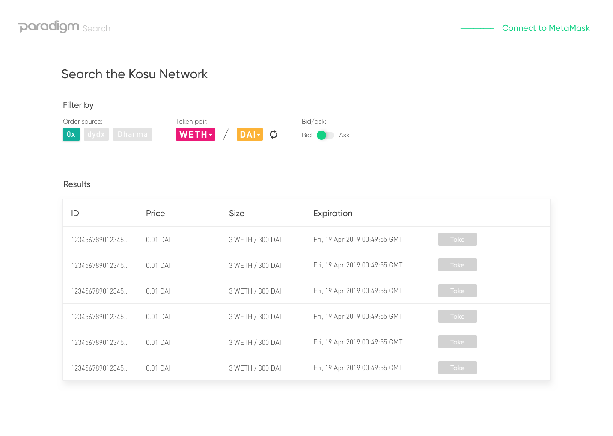
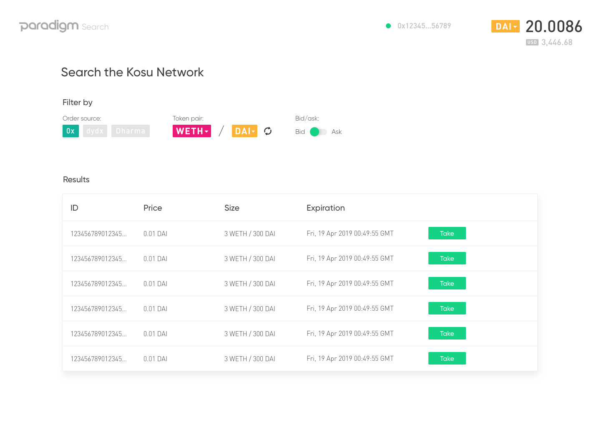
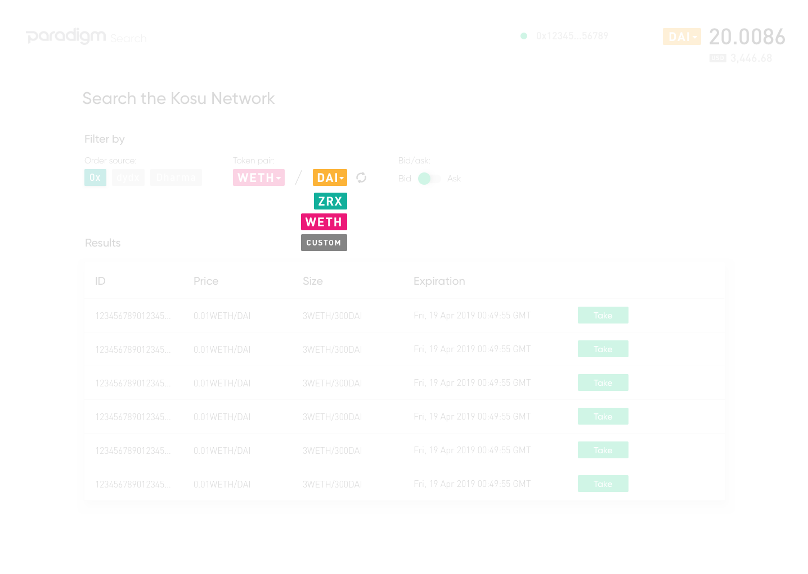
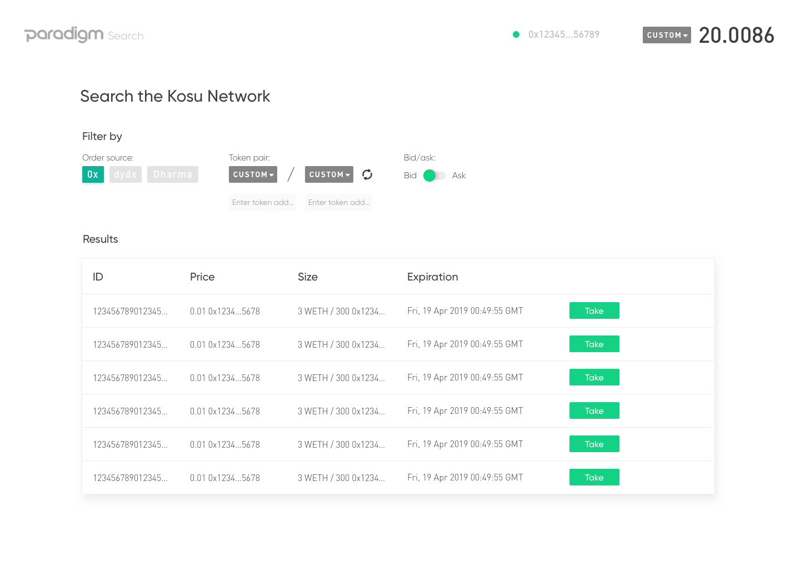
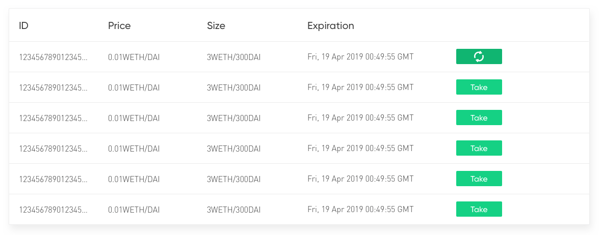

# Portal specification: `Search`

Specification document (this README), [design screenshots](./images), [API reference](#api-reference), [code samples](#code-samples), and the [master sketch file](./search.sketch) for the Paradigm/Kosu search portal.

## Contents

- [Background](#background)
    - [Prerequisites](#prerequisites)
- [Specification](#specification)
    - [Main page](#main-page)
    - [Filter form](#filter-form)
    - [Order table](#order-table)
- [API Reference](#api-reference)
    - [Orders for query](#orders-for-query)
    - [Order by ID](#order-by-id)
- [Code samples](#code-samples)
    - [Load address](#load-address)
    - [Execute fill](#execute-fill)
    - [Check fill status](#check-fill-status)
    - [Verify fill status](#verify-fill-status)
    - [Check allowances](#check-allowances)
    - [Check balances](#check-balances)
    - [Await transaction](#await-transaction)

## Background
The search portal enables users to view and fill [0x](https://0x.org) orders that have been relayed through the [Kosu](https://docs.kosu.io) network. It provides a simple interface to query orders across token pairs for bids and asks, and to sort by price and size.

The portal relies on an external RPC API server to act as a bridge between the Kosu network and clients. This API server is not yet built, and the underlying Kosu network is not yet relaying orders. However, the REST API for the RPC server is defined here, and it will eventually be built to meet this spec. 

The [specification](#specification) section contains screenshots of relevant states, however the full [sketch file](./search.sketch) should still be reviewed in detail.

### Prerequisites
- Basic understanding of the 0x system ([link](https://github.com/0xProject/0x-protocol-specification/blob/master/v2/v2-specification.md))
- Basic understanding of `web3` and Ethereum ([link](https://web3js.readthedocs.io/en/1.0/))
- Usage of the `0x.js` library and other 0x tools ([link](https://0x.org/docs/0x.js))
- Understanding of quote vs. base currency ([link](https://en.wikipedia.org/wiki/Currency_pair))
- Understanding of bids vs. asks and relation to currency pair ([link](https://www.investopedia.com/terms/b/bid-and-ask.asp))
- Understanding of basic order book concepts ([link](https://en.wikipedia.org/wiki/Central_limit_order_book))

## Specification

### Main page

#### On load

#### Metamask connection

#### Showing balances

### Filter form

#### Standard tokens

#### Bid and ask

#### Token drop-down

#### Standard to custom

#### Custom to custom

#### Coming soon

#### Search button

### Order table

#### Prompt to fill

#### Confirmation and signature

#### Pending state

#### Successful fill

#### Failed fill

## API Reference
API reference for a future middleware server that will respond to client requests from a database of Kosu orders.

### Orders for query
Load and paginate historical orders submitted by a given maker's trading `pair`, and order `side` (bid/ask).

### Order by ID
Load a full 0x order object from the Kosu network, provided an `orderId` string.

## Code samples
JavaScript code samples for working with the `0x.js` and `web3` libraries for checking balances and filling orders.

### Load address

### Execute fill

### Check fill status

### Verify fill success

### Check allowances

### Check balances

### Await transaction