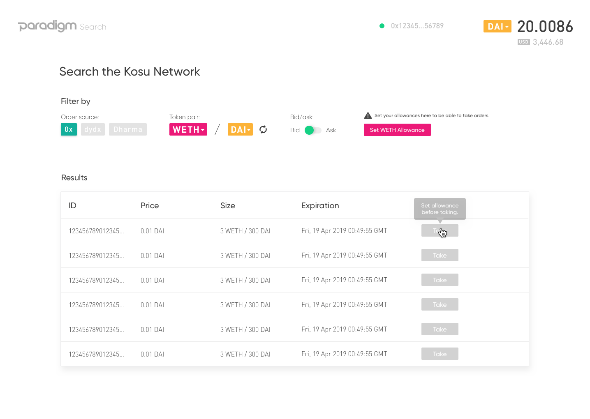
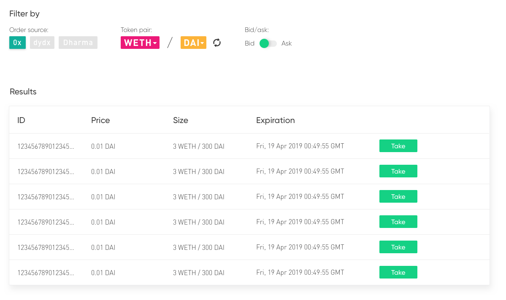
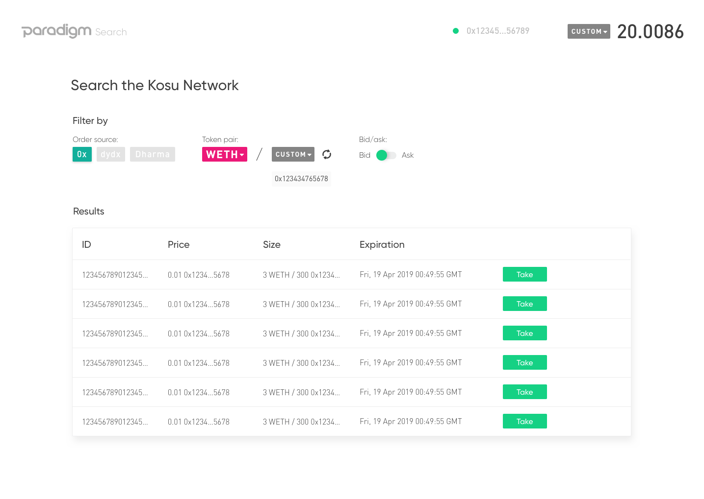
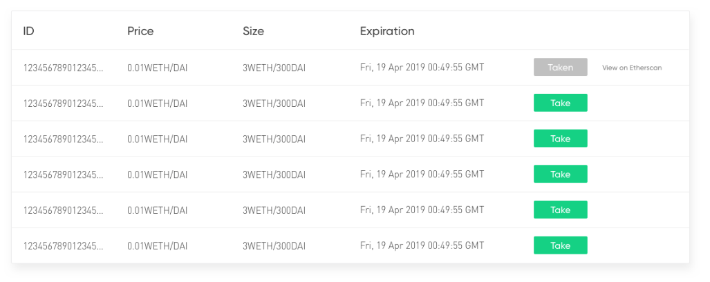

# Portal specification: `Search`

Specification document (this README), [design screenshots](./images), [API reference](#api-reference), [code samples](#code-samples), and the [master sketch file](./search.sketch) for the Paradigm/Kosu search portal.

## Contents

- [Background](#background)
    - [Prerequisites](#prerequisites)
    - [Notes](#notes)
- [Specification](#specification)
    - [Main page](#main-page)
        - [On load](#on-load)
        - [Metamask connection](#metamask-connection)
        - [Showing balances](#showing-balances)
    - [Allowances](#allowances)
        - [No proxy allowance standard](#no-proxy-allowance-standard)
        - [No proxy allowance custom](#no-proxy-allowance-custom)
    - [Filter form](#filter-form)
        - [Standard tokens](#standard-tokens)
        - [Bid and ask](#bid-and-ask)
        - [Token drop-down](#token-drop-down)
        - [Standard to custom](#standard-to-custom)
        - [Custom to custom](#custom-to-custom)
        - [Coming soon](#coming-soon)
    - [Order table](#order-table)
        - [Prompt to fill](#prompt-to-fill)
        - [Confirmation and signature](#confirmation-and-signature)
        - [Pending state](#pending-state)
        - [Successful fill](#successful-fill)
        - [Failed fill](#failed-fill)
- [API Reference](#api-reference)
    - [Orders for query](#orders-for-query)
        - [Request](#request-format)
        - [Response](#response-format)
    - [Order by ID](#order-by-id)
        - [Request](#request-format-1)
        - [Response](#response-format-1)
- [Code samples](#code-samples)
    - [Connect to Metamask](#connect-to-metamask)
    - [Initialize 0x contracts](#initialize-0x-contracts)
    - [Load user address](#load-user-address)
    - [Check order status](#check-order-status)
    - [Verify fill](#verify-fill)
    - [Execute fill](#execute-fill)
    - [Check proxy allowance](#check-proxy-allowance)
    - [Set proxy allowance](#set-proxy-allowance)
    - [Check token balance](#check-token-balance)
    - [Await transaction success](#await-transaction-success)
    - [Validate Ethereum address](#validate-ethereum-address)
    - [Get gas price](#get-gas-price)
    - [Standard tokens](#standard-tokens)

## Background
The search portal enables users to view and fill [0x](https://0x.org) orders that have been relayed through the [Kosu](https://docs.kosu.io) network. It provides a simple interface to query orders across token pairs for bids and asks, and to sort by price and size.

The portal relies on an external RPC API server to act as a bridge between the Kosu network and clients. This API server is not yet built, and the underlying Kosu network is not yet relaying orders. However, the REST API for the RPC server is defined here, and it will eventually be built to meet this spec. 

The [specification](#specification) section contains screenshots of relevant states, however the full [sketch file](./search.sketch) should still be reviewed in detail.

### Prerequisites
- Basic understanding of the 0x system ([link](https://github.com/0xProject/0x-protocol-specification/blob/master/v2/v2-specification.md))
- Basic understanding of `web3` and Ethereum ([link](https://web3js.readthedocs.io/en/1.0/))
- Usage of the `0x.js` library and other 0x tools ([link](https://0x.org/docs/0x.js))
- Understanding of quote vs. base currency ([link](https://en.wikipedia.org/wiki/Currency_pair))
- Understanding of bids vs. asks and relation to currency pair ([link](https://www.investopedia.com/terms/b/bid-and-ask.asp))
- Understanding of basic order book concepts ([link](https://en.wikipedia.org/wiki/Central_limit_order_book))

### Notes
- Use `BigNumber`instances for balances and allowances (can be imported from `0x.js`)
- Remember to convert to/from `wei` units where necessary ([more info](http://ethdocs.org/en/latest/ether.html))

## Specification
This section describes the necessary functionality of the search portal, and maps design screenshots to the functionality that must be implemented for each section, based on the [code samples](#code-samples) and [external API](#api-reference).

The Kosu search portal essentially consists of one page that offers a form to search for and load orders from an external order book. Loaded orders offer a "take" button to submit the order to the Ethereum blockchain for settlement via the 0x smart contract pipeline. 

It offers the ability to set allowances for the 0x proxy contract prior to settlement, depending on weather or not the user already has an allowance set. 

### Main page

The states in this section indicate the default state of the portal as displayed to the user on load.

Prior to interacting with any functionality of the portal, the user must [allow the website access](#connect-to-metamask) to their Metamask account by clicking "Connect to Metamask."

#### On load
https://sketch.cloud/s/YjEQL/a/3edMxZ

- The default state is to load bids for the WETH/DAI pair.
- Prior to successful connection, the "take" action on loaded orders should be disabled.
- When Metamask is not connected, the user should be prompted to connect (top-right).
- Clicking "connect to metamask" should trigger the [connection function.](#connect-to-metamask)
- The initialized `web3` and [necessary 0x contract instances](#initialize-0x-contracts) should be saved to accessible state.

#### Metamask connection
https://sketch.cloud/s/YjEQL/a/qrG9my

- After successful connection ([connection function](#connect-to-metamask) resolves with no error) the [user's `coinbase` address](#load-user-address) should be displayed.
- Additionally, their DAI balance (and USD conversion) should be displayed as well.

#### Showing balances
https://sketch.cloud/s/YjEQL/a/7Dz5Y2

- The top navigation bar always show's the user's `coinbase` address, and balance of the quote token.
- If the base and quote tokens are switched (via "token pair", or the switch button) the displayed balance should update to the new quote asset.
- Balances for tokens can be loaded with [a method like this example.](#get-token-balance)
- For [standard tokens,](#standard-tokens) the address can be loaded from an in-state mapping.
- For custom tokens, the address can be used directly, [after validation.](#validate-ethereum-address)

### Allowances
Trading within the 0x ecosystem requires setting an "allowance" for a smart contract that helps facilitate the trade of tokens. This is called a proxy allowance, and must be set for each token in the trading pair (the selected base and quote asset)

Each time the a token within the "token pair" is changed, the user's [proxy allowances should be checked](#check-proxy-allowance) for each token in the pair (by address).

If an allowance must be set for one of the tokens in the pair, the user should be prompted to [set an unlimited proxy allowance](#set-proxy-allowance) for that token's address.

If more than one (i.e. both) assets in the pair do not have sufficient allowances set, the prompt to set an allowance for each should be displayed (see below). The user should be prompted to set the an allowance for the base asset first, then the quote asset.

#### No proxy allowance standard
https://sketch.cloud/s/YjEQL/a/JD1G4r

- If there is [no proxy allowance](#check-proxy-allowance) for a standard token, this state can be shown.
- The button "set {TICKER} allowance" should trigger [setting an unlimited proxy allowance](#set-proxy-allowance) for that token address.

#### No proxy allowance custom
https://sketch.cloud/s/YjEQL/a/ZyGwYp

- If there is [no proxy allowance](#check-proxy-allowance) for a custom token, this state can be shown.
- The button "set {ADDRESS} allowance" should trigger [setting an unlimited proxy allowance](#set-proxy-allowance) for that token address, after the custom address [is validated.](#validate-ethereum-address)
- The full address should not be shown, but instead concatenated as `0x14d..35a` (for example).

### Filter form

The filter form section allows the user to query for fillable orders from the Kosu network, based on a token pair (base/quote token) and a side (either "bid" or "ask").

Each time the form is updated, [a matching query](#search-for-orders) should be made to the REST API server, based on the state of the form.

A new query should be made (and the [order table](#order-table) updated) whenever: 
- A new base asset is selected via drop down
- A new quote asset is selected via drop down
- A new custom base token address is entered and validated as an Ethereum address
- A new custom quote token address is entered and validated as an Ethereum address
- The base and quote asset are switched (switch button)
- The "bid/ask" toggle is switched

Additionally, whenever a new base or quote asset is selected, [allowances must be checked](#check-proxy-allowance) for the newly selected token(s). See [the allowance section](#allowances) as well.

#### Standard tokens
https://sketch.cloud/s/YjEQL/a/qrG9my

- Some [common ERC-20 tokens](#standard-tokens) are available for selection via a [drop down](#token-drop-down) menu.
- Both a base (leftmost, WETH here) and quote (rightmost, DAI here) asset can be selected.
- This state shows a standard token loaded for both base and quote asset.
- Notice the quote asset's balance (DAI) is displayed to the user.

#### Bid and ask
https://sketch.cloud/s/YjEQL/a/maZl4g

- The "bid/ask" toggle can be flipped.
- When toggled, a [new call to `/search`](#search-for-orders) should be made, triggering the [order table](#order-table) to update.

#### Token drop-down
https://sketch.cloud/s/YjEQL/a/LjEPGQ

- The drop down menu for quote and base tokens allows selection of pre-set [standard tokens](#standard-tokens) and custom.
- Base and quote currency must be different, so if a user tries to set the quote token for what is currently the base token, base and quote should be switched (same as clicking switch button).
- The "custom" selection allows a user to enter a custom ERC-20 token address (see [here](#standard-to-custom)).
- Whenever a new token is selected for either base or quote:
    - [Allowances must be checked](#allowances) for the new token.
    - A new REST API call [must be made to `/search`](#search-for-orders) with the new token(s).

#### Standard to custom
https://sketch.cloud/s/YjEQL/a/DvezjJ

- This state shows a standard token as the base token, and a custom token as the quote token.
- Note that displayed prices and sizes in the [order table](#order-table) now show a shortened address instead of  a standard token ticker.
- When custom is selected, a new API call should not be made until the user has entered a custom token address [and it has been validated.](#validate-ethereum-address)

#### Custom to custom
https://sketch.cloud/s/YjEQL/a/ajYZ95

- This state shows a custom token selected for both the base and quote tokens.
- Note that displayed prices and sizes in the [order table](#order-table) now show a shortened address instead of a ticker from a standard token.
- When custom is selected, a new API call should not be made until the user has entered a custom token address [and it has been validated.](#validate-ethereum-address)
- In this case, a new API call should only be made after _both_ custom token addresses have been entered and validated.

#### Coming soon
https://sketch.cloud/s/YjEQL/a/Ok9ADk

- The "order source" selection can currently only be 0x orders.
- The other selections (dY/dX and Dharma) should be disabled.
- If the user hovers over those options, this tooltip can be displayed.

### Order table
The order table is where quote snapshots are loaded from the [external API,](#api-reference) based on the [form values](#filter-form) selected by the user.

The quotes displayed in the table are based on response objects from the [the `/search`](#search-for-orders) API method, and if the user clicks "take" on a given quote, the full order is loaded with [the `/order`](#order-by-id) method.

Each time [the form](#filter-form) is updated, a new set of quotes should be loaded from the API.

#### Prompt to fill
https://sketch.cloud/s/YjEQL/a/qrG9my

- If [allowances are correctly set,](#allowances) the "take" button can be displayed to user's for each quote.
- Clicking "take" should trigger the following actions:
    - The button should [display the animated loading icon](#pending-state) while the following asynchronous actions complete.
    - Load the full order based on the quote's `orderId` from [the `/order`](#order-by-id) method.
    - [Check the order's status](#check-order-status) to ensure it is fillable.
    - [Verify the fill will succeed](#verify-fill) if submitted on chain.
    - After the above completes, the button should display "confirm" (see [next state](#confirmation-and-signature)).
- If the validation fails, show the [failed state.](#failed-fill)

#### Confirmation and signature

- After the [pre-fill checks](#prompt-to-fill) complete (triggered by user clicking "take") they are prompted to confirm the fill.
- If the user clicks "confirm" again, the following should take place:
    - TThe button should [display the animated loading icon](#pending-state) while the following asynchronous actions complete.
    - [The fill should be executed,](#execute-fill) triggering a Metamask prompt to the user.
    - The loading animation should continue to display [while the transaction awaits confirmation.](#await-transaction-success)
    - When the promise returned from `awaitTransactionSuccess` resolves, the button should display "taken" (see [here](#successful-fill)). 
- If the fill fails, show the [failed fill state.](#failed-fill)

#### Pending state
https://sketch.cloud/s/YjEQL/a/44R01d

- This state is displayed while [async validation](#prompt-to-fill) and [async execution](#confirmation-and-signature) occur.
- The displayed icon in the button should rotate to indicate pending requests and transactions.

#### Successful fill
https://sketch.cloud/s/YjEQL/a/eJPe2q

- This state can be displayed when a [fill completes](#confirmation-and-signature) successfully.
- Clicking on the "taken" button should take the user to the Etherscan TX page corresponding to the [fill transaction ID.](#execute-fill)

#### Failed fill
https://sketch.cloud/s/YjEQL/a/GGAvZb

- This state can be displayed when a fill or validation fails when attempting to take an order.
- If the failure is [during the fill execution,](#execute-fill) no link is needed.
- If the failure is during [awaiting the fill being mined,](#await-transaction-success) the button can link to Etherscan for that transaction ID.
- If the failure is during [fill validation](#validate-fill), no link is needed.

## API Reference
API reference for a future middleware server that will respond to client requests from a database of Kosu orders.

### Search for orders
Load and paginate an order-book snapshot of quotes rom the Kosu network by supplying a `baseAsset` address, `quoteAsset` address, and a `side` (bid/ask).

The returned quotes include `orderId` values which can be used to load the full executable order with the [`/order` method.](#order-by-id)

#### Request format
- **API Path:** `/search`
- **Query Parameters:**

    | Name | Required | Default | Description |
    | :--: | :------: | :-----: | :---------- |
    |`baseAsset`|`true`|-|Base asset token address.|
    |`quoteAsset`|`true`|-|Quote asset token address.|
    |`side`|`true`|-|Specify to retrieve `bid` or `ask` orders for the pair.|
    |`page`|`false`|`1`| The page number to retrieve (based on `perPage`).| 
    |`perPage`|`false`|`10`|The number of order stubs to load per page.|
- **Example:**
    ```bash
    curl 'https://search.zaidan.io/api/v1/search?baseAsset=0x9f8f72aa9304c8b593d555f12ef6589cc3a579a2&quoteAsset=0x89d24a6b4ccb1b6faa2625fe562bdd9a23260359&side=ask&perPage=2'
    ```
#### Response format
- **Headers:**
    - Content-Type: `application/json`
- **Body:**
    ```json
    {
        "side": "ask",
        "quoteAssetAddress": "0x9f8f72aa9304c8b593d555f12ef6589cc3a579a2",
        "baseAssetAddress": "0x89d24a6b4ccb1b6faa2625fe562bdd9a23260359", 
        "page": 1,
        "perPage": 2,
        "quotes": [
            {
                "price": "21624920000000",
                "size": "534680005130000000",
                "expiration": "1561496835",
                "orderId": "0x012761a3ed31b43c8780e905a260a35faefcc527be7516aa11c0256729b5b351bc33"
            },
            {
                "price": "216249200000000000",
                "size": "53468000513000000000",
                "expiration": "1561497137",
                "orderId": "0x013842a3ed31b43c8780e905a260a35faefcc527be7516aa11c0256729b5b3518891"
            }
        ]
    }
    ```
- **Notes:**
    - Expiration times are UNIX timestamps (seconds).
    - Expiration times should be converted to JavaScript `Date` objects. 
    - Prices and sizes (`price` and `size`) are in base units (wei) of the quote asset.
    - Prices and order sizes should be converted to `BigNumbers` for storage/processing (for precision).
    - The `orderId` for an quote can be used in the [`/order`](#order-by-id) method to get the full order.

### Order by ID
Load a full 0x order object from the Kosu network, provided an `orderId` string.

#### Request format
- **API Path:** `/order`
- **HTTP Method:** `GET`
- **Query Parameters:**

    | Name | Required | Default | Description |
    |:---: | :------: | :-----: | :---------- |
    |`id`| `true` | - | The hex-encoded transaction ID of the order to fetch.|
- **Example:**
    ```bash
    curl 'https://search.zaidan.io/api/v1/order?id=0x3b5d97f1a8d0eb833fe1954f87ec3e8099a1d012f5aac397c987b414060546af'
    ```

#### Response format
- **Headers:**
    - Content-Type: `application/json`
- **Body:**
    ```json
    {
        "id": "0x3b5d97f1a8d0eb833fe1954f87ec3e8099a1d012f5aac397c987b414060546af",
        "order": {
            "makerAddress": "0xa916b82ff122591cc88aac0d64ce30a8e3e16081",
            "makerAssetAmount": "1000000000000000000",
            "takerAssetAmount": "1000000000000000000",
            "expirationTimeSeconds": "1559941224",
            "makerAssetData": "0xf47261b0000000000000000000000000e41d2489571d322189246dafa5ebde1f4699f498",
            "takerAssetData": "0xf47261b000000000000000000000000089d24a6b4ccb1b6faa2625fe562bdd9a23260359",
            "makerFee": "0",
            "takerFee": "0",
            "salt": "45038821417800674048750115101428369947416636882675537172847246510449321143785",
            "exchangeAddress": "0x4f833a24e1f95d70f028921e27040ca56e09ab0b",
            "takerAddress": "0x0000000000000000000000000000000000000000",
            "feeRecipientAddress": "0x0000000000000000000000000000000000000000",
            "senderAddress": "0x0000000000000000000000000000000000000000",
            "signature": "0x1cfab1d9c5df24fa0f74f274b4e0668735bfd9faf029448b6925b795f3a97ce75826bbdfdfaad7eb40692e239726dfc36d74e740e579cb561cd6a798ad92921c4202"
        }
    }
    ```

## Code samples
JavaScript code samples for working with the `0x.js` and `web3` libraries for checking balances and filling orders.

Most of the function implementations can be copy/pasted, except for the loading of required "globals" such as initialized `ContractWrapper` and `Web3` instances. These should be loaded from front-end state management (redux) and initialized/saved during the "connect to metamask" saga.

### Connect to Metamask
Use the following sample to connect to Metamask and load the user's `coinbase` address. This action should be triggered by a user clicking the "Connect to MetaMask" button. If the following throws, it can be assumed the user is in an incompatible browser (or doesn't have Metamask installed).

The `web3` instance and `coinbase` address should be saved and accessible throughout the application.

```javascript
import Web3 from "web3";

async function connectMetamask() {
    if (window.ethereum !== void 0) {
        try {
            // will prompt user with pop-up to allow site access
            await window.ethereum.enable();

            // load this web3 into state somewhere (needed later)
            web3 = new Web3(window.ethereum);

            // additionally, store the users address somewhere
            coinbase = await web3.eth.getCoinbase();
        } catch (error) {
            throw new Error("user denied site access");
        }
    } else if (window.web3 !== void 0) {
        // same as above, var (or let) scoped, or stored in redux state
        web3 = new Web3(web3.currentProvider);
        coinbase = await web3.eth.getCoinbase();

        // optional
        global.web3 = web3;
    } else {
        throw new Error("non-ethereum browser detected");
    }
  }

```
### Initialize 0x contracts
During main initialization, when Metamask is connected, some 0x contract code used to verify and fill trades must be initialized. The objects indicated below must be saved and accessible through the applications state, just like the `web3` instance.

```javascript
import { Web3Wrapper } from "@0x/web3-wrapper";
import { ContractWrappers } from "0x.js";

// passed in `web3` should be from Metamask initialization
async function initZeroEx(web3) {
    const networkId = await web3.eth.net.getId();

    // save the following two objects in application state
    const web3Wrapper = new Web3Wrapper(web3.currentProvider);
    const contractWrappers = new ContractWrapper(web3Wrapper.getProvider(), { networkId });

    return {
        web3Wrapper,
        contractWrappers
    };
}
```

### Load user address
The user's `coinbase` address may be loaded any time from an [initialized `web3`](#connect-to-metamask) instance. It should be stored in-state for easy access.

```javascript
async function getCoinbase() {
    const coinbase = await web3.eth.getCoinbase();
    return coinbase;
}
```

### Check order status
Prior to [verifying](#verify-fill) or actually [filling an order](#execute-fill) as a taker, the maker order must be checked for its fillable status.

```javascript
// pseudocode - should be loaded from redux state
const { contractWrappers } = state;

// the order object should come from API call
async function isFillable(order) {
    const info = await contractWrappers.exchange.getOrderInfoAsync(order);
    if (info.orderStatus !== 2) {
        return false;
    }
    return true;
}
```

### Verify fill
Before actually [submitting an order for settlement,](#execute-fill) the trade can be "simulated" using the 0x libraries to ensure it will fill successfully.

```javascript
import { BigNumber } from "0x.js";

// pseudocode - should be loaded from redux state
const { contractWrappers } = state;

// order should come from API call, taker should be the user's coinbase address
// if this function *does not* throw, the fill can be assumed to succeed
async function validateFill(order, taker) {
    const takerAmount = new BigNumber(order.takerAssetAmount);
    try {
        await contractWrappers.exchange.validateFillOrderThrowIfInvalidAsync(
            order,
            takerAmount,
            taker
        );
    } catch (error) {
        throw new Error(`validate fill failed: ${error.message}`);
    }
}
```

### Execute fill
After all verification steps have passed, and the user clicks the "confirm" button, the order can be settled on-chain through the 0x smart contracts.

Unlike the demo method for setting ERC-20 proxy allowances, this method will resolve after the transaction is signed and submitted to the transaction ID. To wait for the fill to be mined (i.e. for displaying the pending icon) use the demo method for [awaiting transaction success.](#await-transaction-success)

```javascript
import { BigNumber } from "0x.js";

// pseudocode - should be loaded from redux state
const { contractWrappers, web3 } = state;

// order should come from API call, taker should be the user's coinbase address
async function fillOrder(order, taker) {
    let hash; // will store order txId for viewing on Etherscan
    const takerAmount = new BigNumber(order.takerAssetAmount);
    try {
        hash = await contractWrappers.exchange.fillOrderAsync(
            order,
            takerAmount,
            taker,
            {
                gasPrice: await getGasPrice(web3)
            },
        );
    } catch (error) {
        throw new Error(`fill failed: ${error.message}`);
    }
    return hash;
}
```

### Check proxy allowance
Before a user can fill a trade (the "take" button) they must have an allowance set for the 0x proxy contract for each token in the pair. This function can be used to check if [setting proxy allowances](#set-proxy-allowance) is necessary for either token in the pair.

The user must have an allowance equal to or greater than the `takerAssetAmount` of the maker order they are trying to fill.

```javascript
// pseudocode - load initialized object from redux state
const { contractWrappers } = state;

// returns a BigNumber instance with the current proxy allowance for tokenAddress
async function getProxyAllowance(tokenAddress, userAddress) {
    let allowance;
    try {
        allowance = await contractWrappers.erc20Token.getProxyAllowanceAsync(
            tokenAddress,
            userAddress,
        );
    } catch (error) {
        throw new Error(`unable to get token proxy allowance: ${error.message}`);
    }
    return allowance;
}
```

### Set proxy allowance
Prior to participating in trades through the 0x contract system, the taker (the user) must set token allowances for the 0x proxy contract. An allowance for the 0x proxy contract must be set for each token (base/quote) prior to filling a trade.

This implementation (can be copy/pasted) only resolves after allowance tx is successful and will throw otherwise.

```javascript
// pseudocode - load initialized objects from redux state
const { contractWrappers, web3Wrapper } = state;

// tokenAddress should be the 0x-prefixed Ethereum address of the token to set an allowance for
// userAddress should be the 0x-prefixed Ethereum address of the user (coinbase)
async function setUnlimitedProxyAllowance(tokenAddress, userAddress) {
    // first, prompt user to sign and submit 
    let txId;
    try {
        txId = await contractWrappers.erc20Token.setUnlimitedProxyAllowanceAsync(
            tokenAddress,
            userAddress,
        );
    } catch (error) {
        // user probably denied transaction
        throw new Error(`failed to submit allowance transaction: ${error.message}`);
    }

    // second, wait for the allowance transaction to be mined successfully
    try {   
        await web3Wrapper.awaitTransactionSuccessAsync(txId);
    } catch (error) {
        throw new Error(`allowance transaction failed: ${error.message}`)
    }
    return;
}
```

### Check token balance
This function can be used to check a user's balance for any ERC20 token, provided a 0x-prefixed token address. The value is returned as a `BigNumber` in units of `wei` (base token units).

```javascript
// pseudocode - load initialized objects from redux state
const { contractWrappers } = state;

// tokenAddress is the ERC-20 token address, userAddress is the user's coinbase
async function getTokenBalance(tokenAddress, userAddress) {
    let balance;
    try {
        balance = await contractWrappers.erc20Token.getBalanceAsync(
            tokenAddress,
            userAddress,
        ); 
    } catch (error) {
        throw new Error(`unable to get token balance: ${error.message}`);
    }
    return balance;
}
```

### Await transaction success
This method can be used to return a promise that resolves when a transaction with the provided `txId` is mined in an Ethereum block.

```javascript
// pseudocode - load initialized objects from redux state
const { web3Wrapper } = state;

// 32-byte (0x-prefixed, 66-char) hex encoded transaction hash
async function awaitTransactionSuccess(txId) {
    if (!/^0x[a-fA-F0-9]{64}$/.test(txId)) {
        throw new Error("invalid transaction hash");
    }

    try {
        await web3Wrapper.awaitTransactionSuccessAsync(txId);
    } catch (error) {
        throw new Error(`transaction failed: ${error.message}`);
    }
}
```

### Validate Ethereum address
An Ethereum address is a 20-byte identifier used to receive assets on the Ethereum network, and is usually represented as a 42-character ("0x" prefixed) hexadecimal encoded string. They can be validated with a simple regular expression.

```javascript
// valid addresses are 42 character hex-encoded strings (20 bytes, add 0x prefix)
// the regex used in this method accepts check-summed and non-check-summed addresses
function isValidAddress(maybeAddress) {
    if (typeof maybeAddress !== "string") {
        return false;
    }
    return /^0x[a-fA-F0-9]{40}$/.test(maybeAddress);
}
```

### Get gas price
In order to prevent slow (or expensive) transactions, a reasonable gas price should be used for all fill transactions. This value can be loaded from the [`https://ethgasstation.info`](https://ethgasstation.info) website.

```javascript
// provide instantiated web3 instance, returns BigNumber
async function getGasPrice(web3) {
    // get a reasonable gas price, use 10 if API fails
    const rawRes = await fetch("https://ethgasstation.info/json/ethgasAPI.json");
    const parsed = await rawRes.json();
    const gasPriceGwei = parsed["safeLow"] ? parsed["safeLow"].toString() : "10";
    return new BigNumber(web3.utils.toWei(gasPriceGwei, "Gwei"));
} 
```

### Standard tokens
```
@todo
```